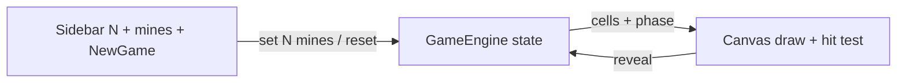

# Static mines game (canvas + sidebar)

## Goals

- **Static only**: no bundler or server required; open `index.html` in a browser.
- **Layout**: fixed **left sidebar** (controls); **main area** with a **single `<canvas>`** for the grid.
- **Grid**: always **N×N**; user sets **grid size N** (default **8**, sensible min/max e.g. 5–24).
- **Mines**: user sets **how many mines** are on the grid via the **left sidebar** (validate `1 ≤ mines ≤ N*N - 1` so at least one safe cell remains).
- **Interaction**: **left-click** a cell to **reveal** it. **Simple rules**: revealed mine → **lose**; revealed safe cell → stay revealed; **win** when every **non-mine** cell has been revealed. This is intentionally **not** Minesweeper: no adjacent-mine numbers, no flood-fill through “empty” regions, and no right-click flags in the core design.

## File layout

| File                       | Role                                                     |
| -------------------------- | -------------------------------------------------------- |
| `[index.html](index.html)` | Structure: sidebar + canvas wrapper, script tags         |
| `[styles.css](styles.css)` | Sidebar width, flex layout, typography, canvas container |
| `[game.js](game.js)`       | Game logic + canvas drawing + input mapping              |

## Sidebar behavior

- Number input: **“Grid size (N×N)”**, `type="number"`, `min`/`max`, default **8**.
- Number input: **“Mines”** (or **“Number of mines”**), `type="number"`, constrained so mines fit the grid (see above).
- **“New game”** button (or auto-restart on change after debounce—button is simpler and avoids accidental resets).
- Read-only or inline validation: if mines are out of range for the current N, disable **New game** or clamp with a visible message.

## Canvas rendering

- **Sizing**: set canvas `width`/`height` in **CSS** to fill the main area (e.g. `width: 100%`, `max-height`), then in JS set `canvas.width` / `canvas.height` to `clientWidth * devicePixelRatio` (and scale the 2D context) so lines stay sharp on high-DPI screens.
- **Cell geometry**: `cellSize = min(floor(canvasWidth / N), floor(canvasHeight / N))` with optional centering offset so the grid is centered in the canvas.
- **Draw order** (per cell): background → border → content (e.g. mine icon vs neutral “safe” revealed state—no 1–8 digit colors unless you deliberately add Sweeper-style hints later).
- **Colors**: clear distinction between hidden, revealed safe, mine (on loss), and optional hover.

## Game logic (core rules)

1. **State**: per cell: `hidden | revealed`; `mine` boolean; game phase `ready | playing | won | lost`.
2. **First click safe**: on first reveal, place **exactly** the sidebar **mine count** randomly on cells **other than** the clicked cell, then apply that reveal (so the first click is never a mine).
3. **Reveal**: clicking a hidden cell reveals it. If mine → **lost** (reveal all mines). If safe → only that cell reveals; **win** when all non-mine cells are revealed.
4. No **chord**, **flag**, or **adjacent count** in scope for this design; add only if you explicitly want Sweeper-like features.

## Input mapping

- `canvas.addEventListener('click', …)` → map `(clientX, clientY)` to cell via `getBoundingClientRect()` and DPR-aware coordinates.
- Ignore clicks when `won`/`lost` until **New game** (or offer a visible restart).

## Data flow (high level)

## Testing checklist (manual)

- Resize window: grid recenters and scales; clicks still hit correct cells.
- Sidebar mine count changes: new games respect the chosen count; invalid counts are blocked or corrected clearly.
- N=8, mines as chosen: first click never hits a mine; win/lose states behave as above.

## Out of scope (unless you want them later)

- Minesweeper-style numbers, flags, and chord.
- Persistence (localStorage), timer, best times, sound, touch long-press.
