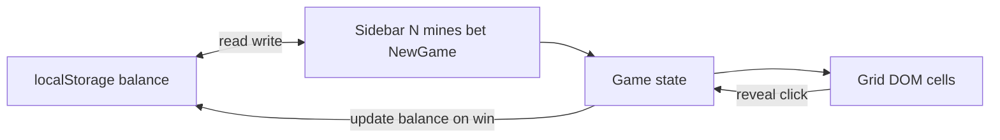

# Static mines game (HTML grid + money)

## Context

The repo currently has no shipped files—only `[.cursor/plans/static_mines_canvas_site_2e6db9de.plan.md](.cursor/plans/static_mines_canvas_site_2e6db9de.plan.md)`, which describes a **canvas** implementation. This plan replaces that approach with an **HTML/CSS grid of cells** and adds **balance + betting** persisted in **localStorage**.

## Goals

- **Static only**: open `index.html` in a browser; no build step.
- **Layout**: **left sidebar** (controls + status); **main** area with a **square grid** of cells.
- **Grid**: always **N×N**; one number input for **N** (sensible bounds, e.g. **5–24**, default **8**).
- **Mines**: sidebar number input; validate `**1 ≤ mines ≤ N×N − 1`**.
- **Money**:
  - Balance stored under a key like `**minesGameBalance`**; default **100** if missing.
  - **Bet** input (min **1**, max **current balance**).
  - **Round economy** (simple, explicit):
    - **New game** (or equivalent start): if `bet > balance`, block with a message; else **deduct `bet` from balance** immediately (stake locked for the round).
    - **Loss** (reveal a mine): no further change (stake already lost).
    - **Win** (all non-mine cells revealed): **return stake + profit**: `balance += bet + floor(bet * profitMultiplier)` where `profitMultiplier` scales with difficulty (e.g. based on **mine ratio** `mines / (N*N)` with a small cap so payouts stay reasonable). Document the formula in a short comment in JS so you can tune it later.
  - After any balance change, **write localStorage** and refresh the displayed balance.

## File layout

| File                       | Role                                                                                                       |
| -------------------------- | ---------------------------------------------------------------------------------------------------------- |
| `[index.html](index.html)` | `aside` sidebar + `main` with `#board` container; load `styles.css` + `game.js`                            |
| `[styles.css](styles.css)` | Flex layout (sidebar + main), grid cell styling, states (hidden / safe / mine / disabled)                  |
| `[game.js](game.js)`       | Board model, mine placement (**first click safe**), reveal / win-lose, DOM grid build, money + persistence |

## HTML grid implementation

- Use a **wrapper** with `**display: grid`** and `**grid-template-columns: repeat(N, 1fr)`** (and matching rows via `N` rows or implicit rows from `N*N` items). Native `**<grid>`** is not a standard layout element; a `**div**` with CSS Grid matches “grid of cells” in practice.
- **Cells**: `button` (keyboard-accessible) or `div[role="button"]` with `tabindex="0"`; prefer `**button`** to avoid extra ARIA wiring.
- **Regenerate** the grid in JS when **N** changes or on **New game** (clear `#board`, append `N*N` nodes, attach listeners once per build).

## Game rules (same spirit as prior plan)

- Per cell: hidden vs revealed; mine boolean; phase `playing | won | lost`.
- **First reveal**: place exactly `**mines`** randomly on cells **other than** the clicked cell, then reveal that cell (first click never a mine).
- **Click** hidden cell → reveal; mine → **lost** (optionally reveal all mines); safe → only that cell; **win** when every non-mine cell is revealed.
- **No** Minesweeper numbers, flags, or flood-fill unless you add them later.

## Sidebar UI

- Number: **Grid size (N×N)** — `type="number"`, `min`/`max`, default **8**.
- Number: **Mines** — constrained by current **N** (update `max` when **N** changes).
- Number: **Bet** — `min="1"`, `max` tied to displayed balance (update after each save).
- **New game** button: validates inputs + `bet ≤ balance`, then resets board state and rebuilds grid if needed.
- Read-only **Balance** display (e.g. “Balance: $100”).
- Short **status** line: playing / won / lost / invalid input.

## Data flow

## Edge cases

- Changing **N** or **mines** mid-round: either **disable** those inputs while playing or **require New game** first; simplest is **disable sidebar controls until round ends** (won/lost), or always use **New game** to start fresh.
- **Insufficient balance**: disable **New game** or show error; never allow negative balance.
- **Invalid mine count** for **N**: clamp or disable **New game** with a visible message.

## Manual test checklist

- Fresh load: balance **100**; refresh preserves balance.
- Bet **10**, **New game**: balance **90**; win restores stake + profit; loss leaves balance at **90**.
- **N** and mine limits enforced; first click never a mine.
- Grid remains clickable and correctly sized after window resize (grid should **fill main area** with a square aspect ratio via CSS, e.g. `aspect-ratio: 1 / 1` + `max-width`/`max-height`).

